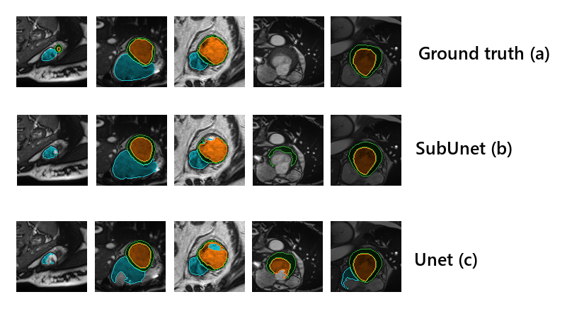
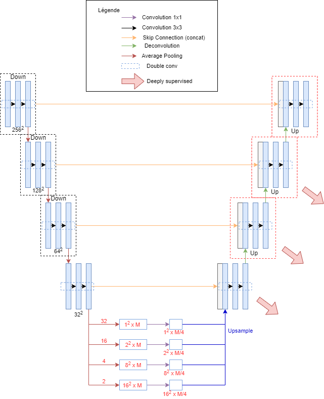

# SubUnet

<!-- ABOUT THE PROJECT -->
## About The Project



SubUnet is a Deep Learning Architecture based on U-Net used for a challenge at Ecole de Technologie Supérieur during Jose Dolz' class. The trained model we submitted ended up in first place.

The purpose of this challenge was to segment the right ventricle (blue), the left ventricle (orange), and the left ventricle myocardial (green), as you can see in the image above.

The architecture of our model is based on Unet, but the lowest layer is replaced by a Pyramidal Pooling Module (presented by PSPNet). This modification and some modifications ported to UNet aimed to increase the receptive field of the model. The schema below presents the whole architecture of our model. The paper we submitted to our professor (FR) is available [here](paper-fr.pdf)



> The dataset used for our project is not available under this repository due to the patients' privacy rights.


<!-- USAGE EXAMPLES -->
## Usage

If you want to use our code to train a model, the following steps will get you started:

- Ensure to have the following file structure for the data folder:
  ```
  Data/
  ├── train/
  │   ├── GT/
  │   └── Img/
  └── val/
      ├── GT/
      └── Img/
  ```
  Then put images in the respective folders.
- Install the needed python packages
  ```sh
  $ pip install -r requirements.txt
  ```
- Run the training:
  ```sh
  python './Source Code/main.py' --root-dir=./path/to/dataset --num-classes=X
  ```
 The `-h` flag can also be used to get all the arguments available.


<!-- LICENSE -->
## License

It is distributed under the MIT License. See `LICENSE.md` for more information.


<!-- CONTACT -->
## Developers

* Michele Bona - *[MicheleBona](https://github.com/MicheleBona)*
* Clémence Gaillotte
* Tristan Michel - *[QuartoTR](https://github.com/QuartoTR)*
* Damien Djomby - *[nowtryz](https://github.com/nowtryz)*
* Enzo Masson - *[enzomasson25](https://github.com/enzomasson25)*
